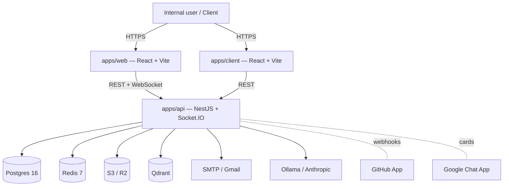

# Nockta Flow

Engineering operations platform for Nockta — a Jira/Linear/ClickUp-style PM tool tuned for a 30-engineer org. Tasks, sprints, boards, timeline/audit log, realtime collaboration, GitHub & Google Chat integration, and an AI assist layer (duplicate detection, blocker summaries, standups).

This repository is a pnpm + Turborepo monorepo. The full design rationale lives in [`GRILL-SUMMARY.md`](GRILL-SUMMARY.md); a per-section inventory of what ships in this commit lives in [`GAP-REPORT.md`](GAP-REPORT.md); the Railway deploy playbook is [`HANDOVER.md`](HANDOVER.md). Newer documentation lives under [`docs/`](docs/).

---

## Stack at a glance

| Layer            | Tech                                                                  |
|------------------|-----------------------------------------------------------------------|
| Web (internal)   | React 18 + Vite + TanStack Query + Tailwind + dnd-kit + Tiptap + Socket.IO client |
| Client portal    | React 18 + Vite (thin SPA — 4 pages)                                  |
| API              | NestJS 10 + Prisma 5 + Socket.IO + BullMQ + Passport (JWT, Google OAuth) |
| Database         | Postgres 16 (`pgcrypto`, `pg_trgm`, `citext`, `btree_gin`; partitioned `Event` table; tsvector FTS; materialized views) |
| Cache / queues   | Redis 7 (sessions, BullMQ, Socket.IO Redis adapter, scheduler leader-election) |
| Object storage   | S3-compatible (MinIO in dev, Cloudflare R2 in prod)                   |
| Vector DB        | Qdrant                                                                |
| Antivirus        | ClamAV                                                                |
| LLM              | Ollama (dev) / Anthropic Claude (prod) — swappable via `LLM_PROVIDER` |
| Email            | Nodemailer (mailhog in dev, Gmail SMTP in prod)                       |
| Observability    | pino structured logs, Prometheus `/metrics`, Sentry (optional), Grafana + Loki + Promtail stack |
| Hosting          | Railway (services per `apps/*/railway.json` + `infra/railway/*`)      |

Workspace layout:

```
apps/
  api/      NestJS — REST + WebSocket + BullMQ workers + schedulers (single deployable)
  web/      Internal SPA
  client/   Client portal SPA
packages/
  types/    Shared enums + DTO types
  sdk/      Typed API client
  ui/       Shared UI primitives
  eslint-config/
  tsconfig/
infra/
  docker-compose.yml   Local dev stack (Postgres, Redis, MinIO, ClamAV, Qdrant, mailhog)
  postgres/init.sql
  prometheus/, grafana/, railway/
docs/      ← this directory (architecture, ADRs, ops, security, env, API)
```

The `apps/workers` folder exists as a vestige; all BullMQ workers and schedulers run in-process inside `apps/api`. See ADR-0004 and [`HANDOVER.md §9`](HANDOVER.md).

---

## Quick start

Prereqs: Node 20+, pnpm 9+, Docker.

```bash
# 1. Clone and install
git clone <repo-url> nockta-flow
cd nockta-flow
pnpm install

# 2. Configure environment
cp .env.example .env
# Generate JWT secrets (the API refuses to boot with placeholders)
pnpm gen:secrets >> .env

# 3. Spin up local dependencies (Postgres, Redis, MinIO, ClamAV, Qdrant, mailhog)
pnpm docker:up

# 4. Run migrations + seed
pnpm db:migrate         # prisma migrate dev
pnpm --filter @nockta/api prisma:seed

# 5. Start dev (API + web + client + supporting services in parallel)
pnpm dev                # bash scripts/dev.sh
# or, apps-only without the docker stack:
pnpm dev:apps
```

Default ports:

| URL                          | Service              |
|------------------------------|----------------------|
| http://localhost:3000        | API (Nest)           |
| http://localhost:3000/docs   | Swagger UI (dev only) |
| http://localhost:3000/health | Liveness probe       |
| http://localhost:5173        | Internal web app     |
| http://localhost:5174        | Client portal        |
| http://localhost:8025        | mailhog (magic links) |
| http://localhost:9001        | MinIO console        |

To wipe local data: `pnpm --filter @nockta/api wipe:local`.

---

## Architecture overview



For request-flow and data-flow detail, see [`docs/architecture.md`](docs/architecture.md).

---

## Feature highlights

- **Tasks & subtasks** — fractional indexing for stable drag-and-drop; cross-project links (`blocks`, `related`, `duplicate`); typed `TaskGithubLink`; per-task visibility (`internal` / `client_visible`); blocked flag separate from status.
- **Sprints** — start / complete with optional carry-over; one-active-sprint-per-project enforced by partial unique index.
- **Boards, backlog, timeline, workload** — TanStack Query for server state; dnd-kit for drag-and-drop; Tiptap for rich text and mentions.
- **Realtime** — Socket.IO with Redis adapter; per-project / per-task / per-user rooms; presence + typing indicators; JWT-in-handshake auth with JTI revocation check.
- **Activity & audit** — partitioned `Event` table; separate `/timeline` (project-scoped) and `/audit-log` (admin) views.
- **Notifications** — in-app + email + web push; per-event preferences; snooze rules; digest mode; mention/watch resolution.
- **AI assist** — embedding-based duplicate detection (Qdrant + cosine), blocker summaries, daily standup generation; provider-swappable (Ollama ↔ Anthropic); per-workspace token caps via `AiUsageEvent`.
- **Integrations** — GitHub App (PR ↔ task linking, auto-status), Google Chat (per-project broadcast cards), import from Jira / Linear with resume support, outbound webhooks with retry/backoff.
- **Multi-tenant workspace boundary** — landed in R6; enforced at the service layer (see ADR-0007).

---

## Deployment

The production target is Railway. See [`HANDOVER.md`](HANDOVER.md) for the full deploy playbook:

- Service inventory (`api`, `web`, `client`, Postgres, Redis, Qdrant, ClamAV, R2/MinIO).
- Boot sequence (`apps/api/scripts/start.sh` runs `prisma migrate deploy` → `companion.sql` → `node dist/main.js`).
- Required env vars (enforced by `apps/api/src/bootstrap-env.ts`).
- DNS and OAuth callback URLs.
- Multi-replica safety via `SchedulerLockService`.

Operator runbook (health checks, migrations, queues, backups, common incidents): [`docs/operations/runbook.md`](docs/operations/runbook.md).
Environment variable reference: [`docs/operations/env.md`](docs/operations/env.md).

---

## Contributing

See [`CONTRIBUTING.md`](CONTRIBUTING.md) for commit format, branch naming, PR checklist, code style, and testing requirements.

Per-app docs:

- [`apps/api/README.md`](apps/api/README.md) — module structure, migrations, testing.
- [`apps/web/README.md`](apps/web/README.md) — dev server, build, components.

Architecture decisions are recorded as ADRs in [`docs/adr/`](docs/adr/). Open a new ADR before making structural changes.

Security: threat model in [`docs/security/threat-model.md`](docs/security/threat-model.md). For vulnerability disclosure, email `security@nockta.com`.

---

## License

Proprietary — © Nockta. All rights reserved. Not for redistribution.
