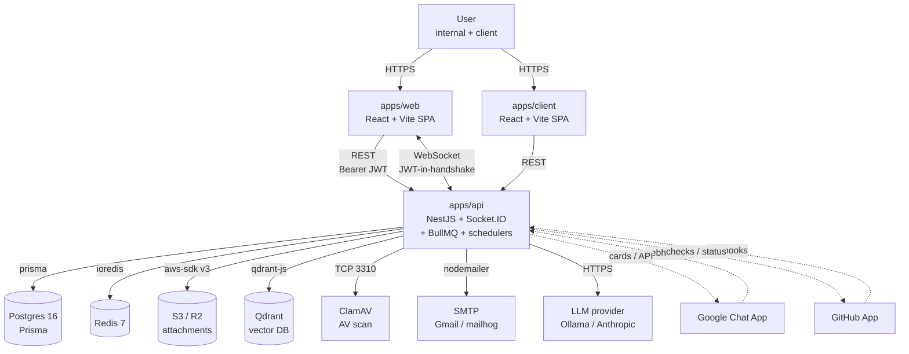

# Architecture

Nockta Flow is a single deployable API behind two single-page applications, with managed Postgres + Redis + S3 in the back. This document explains the boxes, the edges between them, and the request flow for a typical write.

---

## Topology



### Boxes

- **User** — internal engineers on `app.nockta.com`, external clients on `clients.nockta.com`. JWT bearer auth; no cookies.
- **apps/web** — internal Vite SPA. Auth via Google OAuth or magic link; tokens stored in `localStorage`; SDK injects `Authorization: Bearer ...` on every request.
- **apps/client** — slimmer Vite SPA for client-portal users. Same auth model but `User.kind = 'client'`, restricted to `client_visible` task surface.
- **apps/api** — single NestJS process. Hosts REST controllers, Socket.IO gateway (Redis-adapter), BullMQ workers (notifications, attachment scan/thumb, AI embedding, outbound webhooks), and in-process schedulers (maintenance, digests, due-soon, recurrence, AI cron). `numReplicas: 1` per `railway.json`; safe to scale because Redis-backed `SchedulerLockService` arbitrates schedulers and BullMQ self-balances workers.
- **Postgres** — primary store. Prisma owns the schema. `companion.sql` overlays the things Prisma can't express: partial unique indexes, check constraints, tsvector generated columns + GIN indexes, `Event` table partitioned by `createdAt`, materialized views (`mv_workload_open`, `mv_sprint_velocity`, `mv_cycle_time_30d`).
- **Redis** — sessions / JTI revocation (`SessionService`), BullMQ queues, Socket.IO Redis adapter for cross-replica broadcast, scheduler leader-election locks, transient caches (e.g. integration status, CSRF-style nonces for GitHub install).
- **S3 / R2** — `S3_BUCKET` for live attachments, `S3_QUARANTINE_BUCKET` for files held during AV scan. Signed URLs (PUT for upload, GET for download) bound to short TTLs.
- **Qdrant** — vector store for task embeddings; queried by `EmbeddingService` and `AiDispatcherService` for duplicate detection.
- **ClamAV** — invoked by `attachment-scan.processor` over the BullMQ queue; clean files move from quarantine to the live bucket, infected files are deleted and reported.
- **SMTP** — magic-link delivery and notification email channel.
- **LLM provider** — `LLM_PROVIDER=ollama|anthropic`. Embedding model and chat model are configured independently. Token spend is logged per request into `AiUsageEvent` for the per-workspace cap.
- **GitHub App** — installation per workspace. Inbound webhooks at `/api/v1/webhooks/github`; outbound calls (auto-status, check-run) via Octokit with installation token cached in Redis.
- **Google Chat App** — per-project broadcast cards on configurable event types (`Project.chatBroadcastEvents`).

### Edges

- **Web → API REST** — `fetch` from `@nockta/sdk` with Bearer header. All routes are under `/api/v1/*` except `/health` and `/metrics`.
- **Web ↔ API WebSocket** — Socket.IO. JWT is presented in `auth.token` at connection time; the gateway checks the JTI against Redis (`SessionService.isRevoked`) and the `User.archivedAt` flag before accepting.
- **API → Postgres** — Prisma client. Transactions for multi-table writes. Read replicas not currently used (`DATABASE_DIRECT_URL` is for Prisma's migration tooling, not runtime fan-out).
- **API → Redis** — `ioredis` single client for the cache and a separate pair for the Socket.IO adapter (`pub`/`sub`). BullMQ creates its own connections per queue.
- **GitHub / Chat → API** — signed webhooks. Each provider supplies an HMAC secret read from env; the controllers verify before processing.

---

## Request flow — typical write

This is what happens when an authenticated user PATCHes a task to change its assignee. It is the canonical path for almost every state-changing endpoint.

```mermaid
graph TD
  Req[HTTP PATCH /api/v1/tasks/:id<br/>Bearer JWT]
  Throttle[IdentityAwareThrottlerGuard<br/>global / user / auth buckets]
  Jwt[JwtAuthGuard<br/>verify + JTI revocation check]
  Wsg[WorkspaceGuard<br/>resolve workspace from JWT<br/>scope all queries]
  Roles[RolesGuard / Permissions<br/>effectiveRole on Project]
  Pipe[ValidationPipe<br/>class-validator DTO]
  Ctrl[TasksController.patch]
  Svc[TasksService.update<br/>business rules]
  Prisma[(Prisma write<br/>inside transaction)]
  Emit[EventEmitter2<br/>'task.updated']
  EventWriter[event-writer.service<br/>writes Event row]
  Notif[notification-dispatcher<br/>queues BullMQ jobs]
  RT[realtime-broadcaster<br/>socket.emit to rooms]
  AI[ai-dispatcher<br/>queue re-embed if title/desc changed]
  WS[Connected clients<br/>task:{id} + project:{id} rooms]

  Req --> Throttle --> Jwt --> Wsg --> Roles --> Pipe --> Ctrl --> Svc --> Prisma
  Svc --> Emit
  Emit --> EventWriter
  Emit --> Notif
  Emit --> RT
  Emit --> AI
  RT --> WS
  Notif -->|BullMQ| Workers[notification.processor<br/>email / web-push / outbound webhook]
```

### Step-by-step

1. **Throttling.** `IdentityAwareThrottlerGuard` keys on IP for unauthenticated requests, on JWT subject for authenticated requests, and has a dedicated `auth` bucket for login routes (10/min).
2. **Auth.** `JwtAuthGuard` verifies signature against `JWT_ACCESS_SECRET`, decodes the payload, and asks `SessionService` whether the JTI is revoked in Redis. Revoked tokens 401 immediately. The user is loaded and attached to `request.user`.
3. **Workspace scope.** `WorkspaceGuard` resolves the workspace from the JWT claim and pins it onto the request context. All downstream service-layer queries take `workspaceId` as an explicit filter — there is no Postgres RLS (see ADR-0007 for the trade-off).
4. **Authorization.** `RolesGuard` consults `PermissionsService.effectiveRole(user, projectId)`. The effective role is the max of the user's direct grant, any team grants, and the company role (Admin bypass). For tasks, the project is resolved from the task ID.
5. **Validation.** Global `ValidationPipe` with `whitelist: true, forbidNonWhitelisted: true` strips unknown fields and rejects payloads that don't match the DTO (class-validator + class-transformer).
6. **Service layer.** `TasksService.update` runs the business rules (e.g. can't move a parent to Done while children are open; assigning auto-watches; transition validation against the project's workflow preset). Multi-table changes run inside a Prisma `$transaction`.
7. **Persist.** Prisma issues the SQL. On the `Task` row, the `tsvector` generated column updates automatically (`companion.sql`).
8. **Emit.** The service calls `eventEmitter.emit('task.updated', payload)`. The in-process EventEmitter2 dispatches synchronously to its registered listeners.
9. **Fan-out.**
   - `event-writer.service` writes an `Event` row (current-month partition).
   - `notification-dispatcher` resolves recipients via `recipient-resolver` + `preferences.service`, then enqueues BullMQ jobs (`notification`, `web-push`, `outbound-webhook`).
   - `realtime-broadcaster` emits to `project:{id}` and `task:{id}` Socket.IO rooms (Redis adapter fans across replicas).
   - `ai-dispatcher` enqueues a re-embed job if the title/description changed.
10. **Workers.** BullMQ processors run inside the same process. Notifications send email via SMTP, push via VAPID, or POST to user-configured outbound webhooks (with HMAC signing and retry/backoff). Failures count toward `OutboundWebhook.failureCount`; the queue handles retries.
11. **Client.** The browser receives the WebSocket event for the optimistic-UI update; TanStack Query invalidates the relevant queries on reconnect to recover any missed state (no event replay).

### Data flow notes

- **Reads** skip steps 4–10. They go Auth → Workspace → Roles → Service → Prisma → response.
- **Writes from webhooks** (GitHub PR sync, deployment events, Chat interactions) take a different ingress (HMAC-verified webhook controller) but converge on the same service layer and the same EventEmitter fan-out.
- **AI requests** (`/ai/*`) gate on `effectiveRole` + per-workspace token cap (`AiUsageEvent`). Embedding writes go through the BullMQ `ai:embed` queue; chat completions are synchronous against the configured LLM provider.
- **Imports** (Jira / Linear) run in `ImportRun` rows tracked on the queue; partial failures resume from the last successful checkpoint.
- **Schedulers** (maintenance, digests, recurrence) wrap their ticks in `SchedulerLockService.withLock(...)`, which uses `SET key token PX ttl NX` + a Lua CAS release to keep exactly one replica leader for that key at a time.

For the rationale behind each architectural choice, see the [ADRs](adr/).
